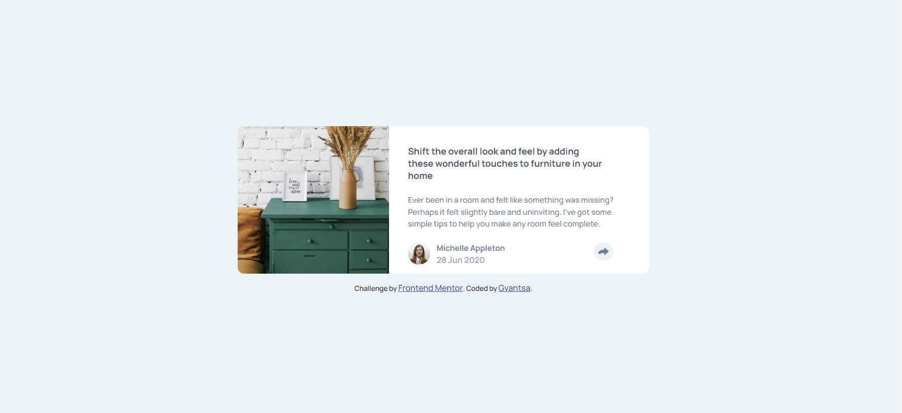

# Frontend Mentor - 3-column preview card component

## Table of contents

- [Overview](#overview)
  - [Screenshot](#screenshot)
- [My process](#my-process)
  - [Built with](#built-with)
- [Author](#author)

## Overview

### Screenshot

## My process

It was fun. Learned how to create triangle shaped div. Also, struggled to invert the color of SVG file. Couldn't make it at the end but still learned something new.
Oh, and I used mobile firts approach.

### Built with

- Semantic HTML5 markup
- CSS custom properties
- Flexbox
- Vanilla JS

## Author

- Frontend Mentor - [https://www.frontendmentor.io/profile/iragvantsa]
